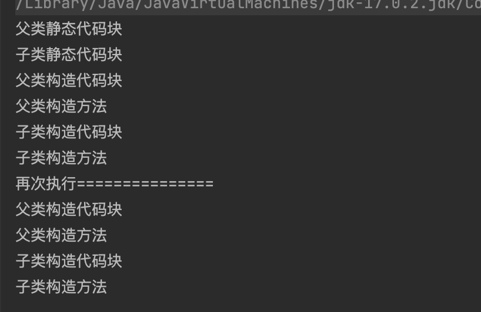

# 执行顺序

**github:**[https://github.com/nocoders/java-everything.git](https://github.com/nocoders/java-everything.git )

## 名词解释

1. **静态代码块**：`java`中使用`static`关键字修饰的代码块，**每个代码块只会执行一次**，JVM加载类时会执行静态代码块中的代码，静态代码块先于主方法执行。
2. **构造代码块**：直接在类中定义的代码块，没有加**static**关键字，在创建实例对象时先于构造方法执行。
3. **构造方法**：创建实例对象的方法

## 代码示例

```java
/**
 * 测试 父类、子类 静态代码块、构造代码块、构造方法执行顺序
 *
 * @author linmeng
 * @date 2023/3/1 14:42
 */
public class DemoTest {

	public static void main(String[] args) {
		new Son();
		System.out.println("再次执行===============");
		new Son();
	}

}


class Parent {

	{
		System.out.println("父类构造代码块");
	}

	static {
		System.out.println("父类静态代码块");
	}

	public Parent() {
		System.out.println("父类构造方法");
	}

}

class Son extends Parent {

	{
		System.out.println("子类构造代码块");
	}

	static {
		System.out.println("子类静态代码块");
	}

	public Son() {
		System.out.println("子类构造方法");
	}

}

```

**执行结果：**



**总结如下：**

由于静态代码块是在方法区中进行加载的，所以静态代码块的加载优先级大于对象的创建。所以父类和子类的静态代码块一定是先加载出来的。

其次，由于Java有一个分层话初始化机制，所以Java会先加载父类对象，其次再加载子类对象。

   构造代码块的代码执行优先级也是大于构造方法的。所以最终的执行次序为：

   父类静态代码块 - 子类静态代码块 - 父类构造代码块 - 父类构造方法 - 子类构造代码块 - 子类构造方法

 

## 参考链接

1. [Java中静态代码块、构造方法、代码块、父类与子类之间执行顺序及父类子类实例化对象](https://janus.blog.csdn.net/article/details/52609341)
2. [Java中子类继承父类，父子类静态代码块、构造代码块以及构造方法的执行次序](https://blog.csdn.net/qq_43097201/article/details/104654602)
3. [父类、子类的静态代码块、构造代码块、静态变量、构造方法执行顺序加深理解](https://blog.csdn.net/WiteWater/article/details/89043462)